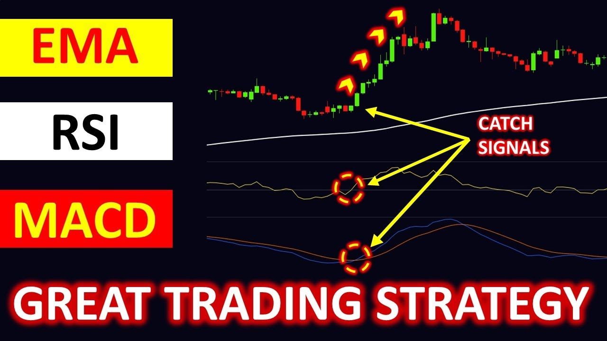
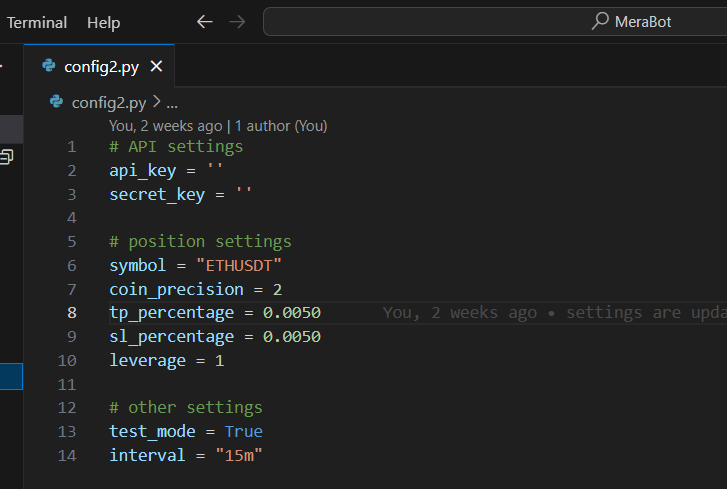
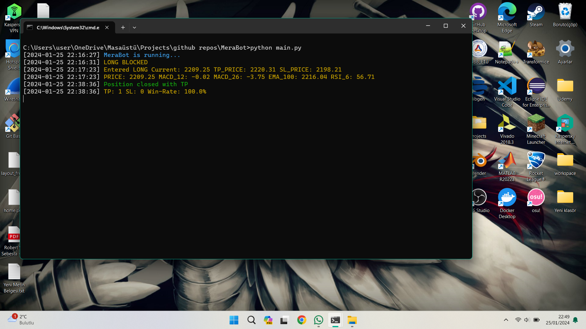

<div align="center">
    <h1> MeraBot </h1>
    
</div>

## Table of Contents

- [Description](#description)

- [How It Works?](#howitworks)

- [Technologies Used](#technologies-used)

- [Installation](#installation)

- [Configuration](#configuration)

- [Running the bot](#running-the-bot)
 
- [Warnings](#warnings) 


## Description

MeraBot stands as an experimental trading bot, functioning based on a specific algorithm. It enters "LONG" or "SHORT" positions depending on the prevailing conditions. Employing artificial intelligence libraries, the application continuously records and analyzes data during runtime. It predicts the outcome of the next transaction by examining the data it persists, using the AI libraries to enter positions when conditions are met. The bot then compares the predicted outcome with the intended position to enter. If the results align, it executes the position. This process ensures that MeraBot makes informed decisions, adapting dynamically to the market conditions it encounters.

<div align="center">
    
</div>

## How It Works?
MERA stands for MACD-EMA-RSI-AI

When certain conditions are met. AI Libraries are used for confirmation.

```bash
    while True:
        if (MACD_12 > MACD_26) and (MACD_12 < 0) and (EMA_100 > price) and (RSI_6 > 50):
            # predict
            if (prediction == "LONG")
                # Enter LONG...
        elif (MACD_12 < MACD_26) and (MACD_12 > 0) and (EMA_100 < price) and (RSI_6 < 50):
            # predict
            if (prediction == "SHORT")
                # Enter SHORT...
```

You can check out this video for MACD Strategies.

<div align="center">
    <a href="https://www.youtube.com/watch?v=Gs-_tleyz3Q&ab_channel=TRADEEMPIRE"> </a>
</div>

## Technologies Used

1. **Python:** The primary programming language driving MeraBot's functionality and logic.

2. **TensorFlow, PyTorch and Scikit Libraries:** These libraries ensure the validation of the accuracy of the algorithm's indicated transaction type.

3. **Binance API:** MeraBot connects seamlessly to the Binance cryptocurrency exchange through its API, allowing real-time access to market data and execution of trades.

4. **TA-Lib Library:** Technical Analysis Library provides essential functions for technical analysis of financial markets, aiding MeraBot in evaluating market indicators.

5. **ChatGPT:** ChatGPT, powered by OpenAI, is employed for code assistance, aiding developers in coding tasks and providing guidance on library usage. Additionally, ChatGPT is utilized for crafting informative log messages, enhancing communication and facilitating a smoother understanding of MeraBot's operations.

<div align="center">
    <p> 
        <a href="https://www.python.org/">  </a>
        <a href="https://www.tensorflow.org/">  </a>
        <a href="https://pytorch.org/">  </a>
        <a href="https://scikit-learn.org/stable/">  </a>
        <a href="https://github.com/sammchardy/python-binance">  </a>
        <a href="https://pypi.org/project/TA-Lib/">  </a>
        <a href="https://chat.openai.com/chat" target="_blank">  </a>
    </p>
</div>

## Installation

To install Project, follow these simple steps:

1.  **Install Python:**  
	- Visit [Python official website](https://www.python.org/downloads/) and download python. 
	- I strongly recommend downloading a version lower than 3.10 and higher than 3 to ensure that you can download it without any issues and run the Talib library smoothly.
2. **Cloning the Project into your local:**
    Go to the directory where you want to download the project using 'cd', and then type the following command
    ```bash
    $git clone https://github.com/basaryldrm06/MeraBot
    ```
3. **Install Dependencies**
    Enter these commands in sequence.
    ```bash
    $cd MeraBot
    $pip install -r requirements.txt
    ```

Upon successfully completing these steps, proceed to configure your settings and run the program.

In case you encounter any issues, kindly attempt to resolve them before moving forward.

If you are facing difficulties downloading the Talib library, consider trying a manual download from this [link](https://www.lfd.uci.edu/~gohlke/pythonlibs/).

## Configuration
Rename the file config2.py to config.py.

Open the config.py file to edit the settings, and fill in the empty fields according to your preferences.

<div align="center">
    
</div>

If you do not have an api key you can obtain one from this [link](https://www.binance.com/en/my/settings/api-management)

You can use the default values for other sections or customize them based on your preferences.

Once you have finished editing your settings, you will be ready to run the program.

## Running the Bot
If you have completed the previous steps, MeraBot is now ready to run. Start it by entering the following command:

 ```bash
$python main.py
```

After running the command, you should see a screen similar to the one below.

<div align="center">
    
</div>

## Warnings
This trading bot has been developed solely for experimental purposes, with the goal of exploring the viability and effectiveness of combining algorithmic decision-making with deep learning in financial transactions. It is a completely experimental project shared as open-source to serve as an example for the development of trading bots.

Any profits or losses incurred using this bot are entirely your responsibility. Please refrain from using the program if you are not familiar with its functionalities. Understand that engaging in financial transactions carries inherent risks, and it's crucial to exercise caution and knowledge when utilizing this bot.

<div align="center">
    
</div>

## Last Words from Developer
I hope you find this project useful and enjoyable.

Artificial intelligence is one of the most significant inventions of our era, with a wide range of applications. While working on this project, my goal was to explore the extent to which the power of artificial intelligence could be applied to financial transactions. For this reason, this project was particularly intriguing and enjoyable for me.

Feel free to follow my account for more projects like this and stay updated on upcoming releases. Don't forget to star and watch this project to receive notifications about future updates and improvements.

If you have any innovative ideas in mind for trading bots or AI, You can reach out to me through the links on my profile. We can collaborate and develop something together.

Thank you for your interest and support! 🚀

<div align="center">
    <p> 
        <a href="mailto:basaryldrm06@gmail.com?subject=Hello%20basaryldrm06">  </a>
        <a href="https://www.linkedin.com/in/basaryldrm06/">  </a>
        <a href="https://github.com/basaryldrm06" target="_blank">  </a>
    </p>
</div>